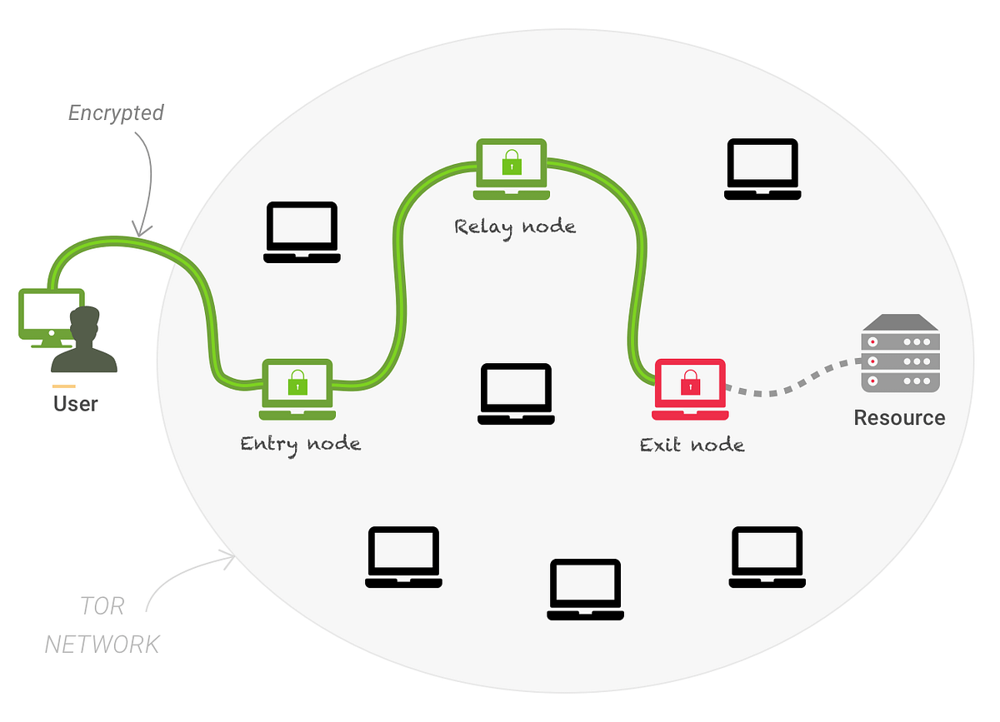

# Peer-to-Peer Networks / Onion Routing: Anonymous Communication in Distributed Systems**

**Author:** Zhivko Stoimchev\
**Email:** [89221056@student.upr.si](mailto:89221056@student.upr.si)\
**Institution:** UP FAMNIT

**Course:** Programming III - Concurrent Programming\
**Project:** Peer-to-Peer Networking Course Project\
**Date:** May 2026

---

## Abstract

Peer-to-Peer Networks / Onion Routing is a Java 21 project that implements a small peer-to-peer onion routing network.
Nodes discover each other, build multi-hop circuits, negotiate a separate symmetric key with every hop, and send HTTP
requests through layered encryption. The goal of the project is not to replace a production anonymity network such as
Tor, but to demonstrate the main ideas behind onion routing, peer discovery, encrypted relaying, and concurrent network
programming.

**Keywords:** Onion Routing, Peer-to-Peer Networks, Anonymous Communication, Java, Docker

## Introduction

Normal internet communication exposes metadata such as the sender, the receiver, and the timing of communication. Even
if the content is encrypted, this metadata can still reveal useful information. Onion routing reduces this problem by
sending traffic through several relay nodes. The sender encrypts the message in layers, one layer for each relay. Each
relay removes only its own layer and forwards the remaining message to the next hop.

ZMIX implements this idea as a course project. Every node runs the same Java program and can act as a client, relay, or
exit node depending on the current circuit. A small bootstrap node is used only to help new peers discover the network.

## System Overview

The system is split into a few main parts. `Server` accepts TCP connections. `Peer` represents one connected node and
handles message reading and writing. `NetworkManager` keeps track of known and connected peers. `PeerDiscoveryProtocol`
exchanges peer lists. `CircuitManager` builds circuits and forwards encrypted traffic. `Cli` allows the user to type a
URL and send it through the network.

The implementation uses Java threads and executor services. Each peer connection has its own I/O task, while received
messages are placed into a shared queue and processed by a message handler. This keeps socket handling separate from
protocol logic.



*Figure 1: Simplified path of a request through a three-hop onion circuit.*

## How It Works

When a node starts, it connects to the bootstrap node and performs a handshake. The handshake exchanges the public key
and listening port of each node. After that, nodes periodically ask connected peers for their known peer lists. This
simple gossip mechanism allows the network to grow without a central directory.

When the user enters a URL, the origin node selects a random path from the known peers. The default circuit length is
three hops. The origin builds the circuit incrementally. First, it creates a connection with the entry relay, then
extends the circuit to the second relay, and finally extends it to the exit relay. For every hop, the origin and relay
use Elliptic Curve Diffie-Hellman to derive a shared AES key.

After the circuit is active, the HTTP request is encrypted three times. The entry relay removes the outer layer, the
middle relay removes the next layer, and the exit relay removes the final layer. The exit relay sends the HTTP request
to the target web server and returns the response through the same circuit in reverse.

## Security Design

Standard Java cryptography is used. Every node has an elliptic-curve key pair. For circuit construction, fresh ephemeral
ECDH keys are generated for each hop. The shared secret is converted into a 256-bit AES key, and data is encrypted using
AES-GCM.

The main privacy property is that no relay sees the full communication path. The entry relay knows the sender but not
the final destination. The exit relay knows the destination but not the original sender. Middle relays only know the
previous and next hop.

## Docker Deployment

Docker Compose is used to run several nodes on one machine. The Compose file defines three service types:
`bootstrap-node`, `config-node`, and a scalable `peer` service. The same Docker image is used for all nodes, with
environment variables controlling whether a container is a bootstrap node and which port it listens on.

### Docker Services

| Service          | Role        | Notes                             |
|------------------|-------------|-----------------------------------|
| `bootstrap-node` | Seed node   | Starts first on port `12137`      |
| `config-node`    | Client node | Used to enter URLs                |
| `peer`           | Relay node  | Can be scaled with Docker Compose |

The network can be started with:

```bash
docker compose up --build --scale peer=10 -d
docker attach config-node
```

After attaching to `config-node`, the user can type a URL such as: `http://example.com`.

## Evaluation

The project was tested in Docker with one bootstrap node, one client node, and four relay peers. After startup, the
client discovered enough peers to create a three-hop circuit. A request to `http://example.com` successfully returned an
HTTP response and saved the HTML output inside the container.

### Docker Test Result

| Metric          | Result               |
|-----------------|----------------------|
| Bootstrap nodes | 1                    |
| Client nodes    | 1                    |
| Relay peers     | 4                    |
| Circuit length  | 3 hops               |
| Test URL        | `http://example.com` |
| HTTP result     | `200 OK`             |
| Response saved  | Yes                  |

## Limitations and Future Work

The main limitations are:

* Only one outbound circuit is supported per node.
* Circuit cleanup after unexpected disconnects is basic.
* The message format is custom and simple.
* Bugs are most probably still present.

Future work would include multiple concurrent circuits, circuit rotation, better failure handling, more tests, and a
small benchmark tool for measuring latency with different circuit lengths.

## Conclusion

This project demonstrates the core ideas of onion routing in a working peer-to-peer Java application. Nodes discover
each other, establish encrypted multi-hop circuits, and forward HTTP traffic without any single relay knowing both the
origin and destination. The project is simplified, but it covers the important building blocks: peer discovery,
concurrent networking, key exchange, layered encryption, and Docker-based distributed testing.
